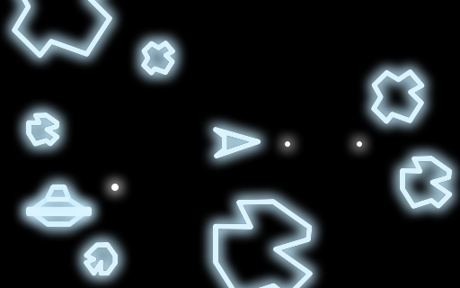

# minimicro-asteroids
## an Asteroids clone for Mini Micro

This is the code from a live-coding session on Twitch on March 20, 2022.  I set myself a goal of recreating the classic arcade game _Asteroids_ in an hour using [MiniScript](https://miniscript.org/) and [Mini Micro](https://miniscript.org/MiniMicro) (with the art assets prepared ahead of time).

I didn't quite make it!  We got a solid start on it in the first hour, and then did another half-hour the following week.  Now you can fly your ship around and shoot the asteroids, which break into smaller chunks until gone; there are sound effects, scoring, and three lives.  The game is playable and fun.  But some features are still missing:

- no UFO
- no reset if you manage to clear the board (not that I have yet managed to do so!)
- no maximum speed for the ship
- turn rate, acceleration, and deceleration probably need a bit more tweaking

I encourage you to fork this project, make some improvements, and submit a PR!

